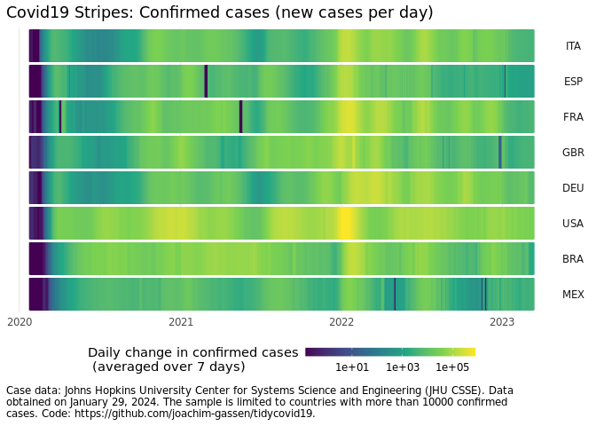
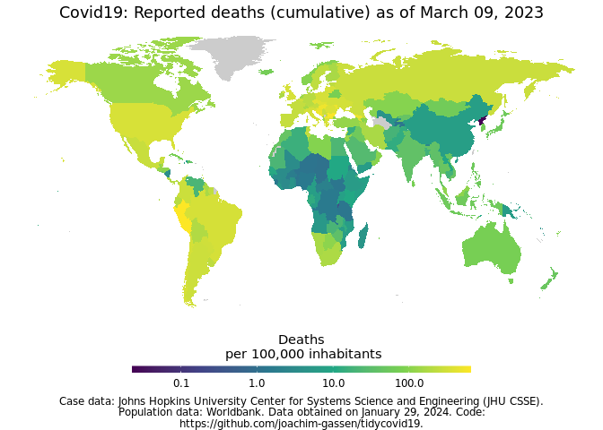
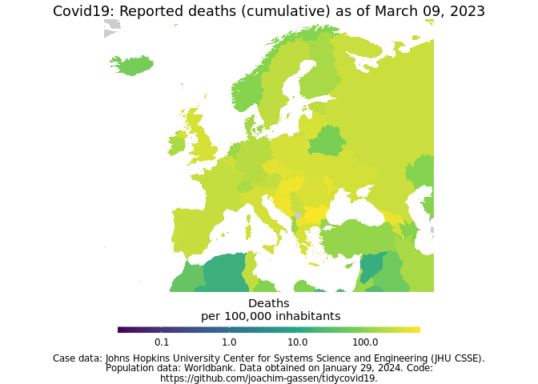

Joachim Gassen

# Download, Tidy and Visualize Covid-19 Related Data

## Disclaimer

I am an applied economist studying the economic effects of regulatory
interventions on corporate transparency and leading the Open Science
Data Center (OSDC) of the [TRR 266 Accounting for
Transparency](https://accounting-for-transparency.de), which is funded
by the German Science Foundation (DFG). The OSDC has the objective to
make research transparent in a way that others can contribute and
collaborate.

This is the spirit that motivated me to set up this package. I am
clearly no epidemiologist so I will abstain from from providing
infrastructure for analyzing the spread of the disease or estimating the
effects of non-pharmaceutical interventions. Instead this package serves
the purpose to facilitate the use of various Covid-19 related data
sources with a special focus on non-pharmaceutical interventions.

In that way, I hope that it might be helpful for others that are
interested in doing research on the Covid 19 pandemic by promoting the
benefits of open science.

## The Data

As of September 07, 2023 these are the included data sources

``` r
data(tidycovid19_data_sources)
df <- tidycovid19_data_sources %>% select(-id)
df$description[nrow(df)] <- paste(
  "The merged dataset provided by the tidycovid19 R package. Contains data",
  "from all sources mentioned above."
)
kable(df) %>% kableExtra::kable_styling()
```

<table class="table" style="margin-left: auto; margin-right: auto;">

<thead>

<tr>

<th style="text-align:left;">

function\_name

</th>

<th style="text-align:left;">

description

</th>

<th style="text-align:left;">

url

</th>

<th style="text-align:left;">

last\_data

</th>

</tr>

</thead>

<tbody>

<tr>

<td style="text-align:left;">

download\_jhu\_csse\_covid19\_data()

</td>

<td style="text-align:left;">

The COVID-19 Data Repository by the Johns Hopkins University Center for
Systems Science and Engineering (JHU CSSE) relies upon publicly
available data from multiple sources that do not always agree. It is
updated daily. The data comes in three data frames that you can select
by the ‘type’ parameter. The ‘country’ data frame contains the global
country-level data reported by JHU CSSE by aggregating over the regional
data for countries that have regional data available. The
‘country\_region’ data frame provides regional data for the countries
that have regional data available (mosty Australia, Canada and China).
The ‘us\_county’ data frame reports the data for the U.S. at the county
level. Please note: JHU stopped updating the data on March 10, 2023.

</td>

<td style="text-align:left;">

<https://github.com/CSSEGISandData/COVID-19>

</td>

<td style="text-align:left;">

2023-03-09

</td>

</tr>

<tr>

<td style="text-align:left;">

download\_ecdc\_covid19\_data()

</td>

<td style="text-align:left;">

Country-level weekly data on new cases and deaths provided by the
European Centre for Disease Prevention and Control (ECDC). The data was
updated daily until 2020-12-14 and contains the latest available public
data on the number of new Covid-19 cases reported per week and per
country.

</td>

<td style="text-align:left;">

<https://www.ecdc.europa.eu/en/covid-19/data>

</td>

<td style="text-align:left;">

2023-08-28

</td>

</tr>

<tr>

<td style="text-align:left;">

download\_owid\_data()

</td>

<td style="text-align:left;">

The Our World in Data team systematically collects data on Covid-19
testing, hospitalizations, and vaccinations from multiple national
sources. Data points are collected with varying frequency across
countries. The definition on what consitutes a ‘test’ varies, reflected
by the variable ‘tests\_units’ in the data frame. The vaccination data
is currently only available based on ad hoc disclosures by a small set
of countries.

</td>

<td style="text-align:left;">

<https://github.com/owid/covid-19-data/tree/master/public/data>

</td>

<td style="text-align:left;">

2023-09-05

</td>

</tr>

<tr>

<td style="text-align:left;">

download\_wbank\_data()

</td>

<td style="text-align:left;">

The data frame reports current country-level statistics from the World
Bank. The regional and income level classifications are also provided by
the World Bank. ‘life\_expectancy’ is measured in years at birth and
‘gdp\_capita’ is measured in 2010 US-$. The original World Bank data
items are (in the order how they are represented in the data frame)
‘SP.POP.TOTL’, ‘AG.LND.TOTL.K2’, ‘EN.POP.DNST’, ‘EN.URB.LCTY’,
‘SP.DYN.LE00.IN’, ‘NY.GDP.PCAP.KD’. When you set the parameter
‘var\_def’ tot ‘TRUE’. the data comes in a list containing two data
frames. The first contains the actual data, the second contains variable
definitions.

</td>

<td style="text-align:left;">

<https://data.worldbank.org>

</td>

<td style="text-align:left;">

2023-09-06

</td>

</tr>

<tr>

<td style="text-align:left;">

download\_acaps\_npi\_data()

</td>

<td style="text-align:left;">

The \#COVID19 Government Measures Dataset is provided by ACAPS. It puts
together measures implemented by governments worldwide in response to
the Coronavirus pandemic. Data collection includes secondary data
review. The data is reported in event structure with an event reflecting
a government measure. Measures are characterized as being either
imposing/extending measures or lifting them and categorized in five
categories with each category being split up in further sub-categories.
Please note: ACAPS stopped updating the data on December 10, 2020

</td>

<td style="text-align:left;">

<https://www.acaps.org/covid19-government-measures-dataset>

</td>

<td style="text-align:left;">

2021-01-04

</td>

</tr>

<tr>

<td style="text-align:left;">

download\_oxford\_npi\_data()

</td>

<td style="text-align:left;">

The data on the Oxford Coronavirus Government Response Tracker (OxCGRT)
on non-pharmaceutical interventions comes in two data frames that you
can select by setting the ‘type’ parameter. The ‘measures’ data frame
reports data on governmental response measures as reported by the Oxford
OxCGRT team. It is tidied by arranging its content by measure. All
original country-day observations that are either initial or represent a
value (not note) change from the previous day are included. Economic
measures (E1-E4) are not included. The ‘index’ data frame reports the
‘Stringency Index’ and the ‘Legacy Stringency Index’ as calculated by
the OxCGRT team based on their governance response measures in a
country-day structure. Please note: As indicated on the homepage of the
project, too a large extend the data is no longer updated after December
31, 2022 while data review processes
continue.

</td>

<td style="text-align:left;">

<https://www.bsg.ox.ac.uk/research/research-projects/coronavirus-government-response-tracker>

</td>

<td style="text-align:left;">

2022-12-31

</td>

</tr>

<tr>

<td style="text-align:left;">

download\_apple\_mtr\_data()

</td>

<td style="text-align:left;">

Apple’s Mobility Trend Reports reflect requests for directions in Apple
Maps. The data frame is organized by country-day and its data are
expressed as percentages relative to a baseline volume on January 13th,
2020. The data comes in three data frames that you can select by the
‘type’ parameter. The ‘country’ data frame contains country-day level
data. The ‘country\_region’ data frame provides regional data for
regions for which Apple reports regional data. The ‘country\_city’ data
frame reports city-level data for cities for which Apple reports this
data. Please note: Apple stopped providing this data on April 14, 2022

</td>

<td style="text-align:left;">

<https://www.apple.com/covid19/mobility>

</td>

<td style="text-align:left;">

2022-04-12

</td>

</tr>

<tr>

<td style="text-align:left;">

download\_google\_cmr\_data()

</td>

<td style="text-align:left;">

Google’s Community Mobility Reports chart movement trends over time
across different categories of places such as retail and recreation,
groceries and pharmacies, parks, transit stations, workplaces, and
residential. They show how visits and length of stays at different
places change in percentages compared to a baseline (the median value,
for the corresponding day of the week, during the 5-week period Jan 3 to
Feb 6, 2020). The data comes in three data frames that you can select by
the ‘type’ parameter. The ‘country’ data frame contains country-day
level data. The ‘country\_region’ data frame provides regional data for
the countries for which Google reports regional data. The ‘us\_county’
data frame reports daily data for the U.S. at the county level. Please
note: Google stopped providing that data on October 15, 2022

</td>

<td style="text-align:left;">

<https://www.google.com/covid19/mobility/>

</td>

<td style="text-align:left;">

2022-10-15

</td>

</tr>

<tr>

<td style="text-align:left;">

download\_google\_trends\_data()

</td>

<td style="text-align:left;">

Data are Google Search Volume (GSV) measures as provided by Google
Trends API, with the default search term ‘coronavirus’. The data comes
in four data frames that you can select by the ‘type’ parameter and the
sample period comprises Jan 1, 2020 up to date. The ‘country’ data frame
lists GSV by country, to assess which country on average uses the search
term most often over the sample period. The ‘country-day’ data frame
reports daily search volume data for all countries that show up in the
‘country’ data frame. Each value is relative within country, meaning
that values across countries cannot be compared directly. The ‘region’
and ‘city’ data frames list the relative GSV across regions and city
within countries when provided by Google Trends. Keep in mind that
within each data frame GSV are relative measures with a maximum of 100
indicating the highest search volume. This implies that GSV measures are
not comparable across data frames.

</td>

<td style="text-align:left;">

<https://trends.google.com/>

</td>

<td style="text-align:left;">

2023-09-03

</td>

</tr>

<tr>

<td style="text-align:left;">

download\_merged\_data()

</td>

<td style="text-align:left;">

The merged dataset provided by the tidycovid19 R package. Contains data
from all sources mentioned above.

</td>

<td style="text-align:left;">

<https://github.com/joachim-gassen/tidycovid19>

</td>

<td style="text-align:left;">

2023-09-06

</td>

</tr>

</tbody>

</table>

## How to Use the Package

The idea is simple. Load the data using the functions above and code
away. So, for example:

``` r
# Suggestion by AndreaPi (issue #19)

library(tidyverse)
library(tidycovid19)
library(zoo)

df <- download_merged_data(cached = TRUE, silent = TRUE)

df %>%
  filter(iso3c == "USA") %>%
  mutate(
    new_cases = confirmed - lag(confirmed),
    ave_new_cases = rollmean(new_cases, 7, na.pad=TRUE, align="right")
  ) %>%
  filter(!is.na(new_cases), !is.na(ave_new_cases)) %>%
  ggplot(aes(x = date)) +
  geom_bar(aes(y = new_cases), stat = "identity", fill = "lightblue") +
  geom_line(aes(y = ave_new_cases), color ="red") +
  theme_minimal()
```


The data comes with two meta data sets that describe the data. The data
frame `tidycovid19_data_sources` listed above provides short
descriptions and links for each data source used by the package. The
data frame `tidycovid19_variable_defintions` provides variable
definitions for each variable included in the merged country-day data
frame provided by `download_merged_data()`:

``` r
data(tidycovid19_variable_definitions)
df <- tidycovid19_variable_definitions %>%
  select(var_name, var_def)
kable(df) %>% kableExtra::kable_styling()
```

<table class="table" style="margin-left: auto; margin-right: auto;">

<thead>

<tr>

<th style="text-align:left;">

var\_name

</th>

<th style="text-align:left;">

var\_def

</th>

</tr>

</thead>

<tbody>

<tr>

<td style="text-align:left;">

iso3c

</td>

<td style="text-align:left;">

ISO3c country code as defined by ISO 3166-1 alpha-3

</td>

</tr>

<tr>

<td style="text-align:left;">

country

</td>

<td style="text-align:left;">

Country name

</td>

</tr>

<tr>

<td style="text-align:left;">

date

</td>

<td style="text-align:left;">

Calendar date

</td>

</tr>

<tr>

<td style="text-align:left;">

confirmed

</td>

<td style="text-align:left;">

Confirmed Covid-19 cases as reported by JHU CSSE (accumulated)

</td>

</tr>

<tr>

<td style="text-align:left;">

deaths

</td>

<td style="text-align:left;">

Covid-19-related deaths as reported by JHU CSSE (accumulated)

</td>

</tr>

<tr>

<td style="text-align:left;">

recovered

</td>

<td style="text-align:left;">

Covid-19 recoveries as reported by JHU CSSE (accumulated)

</td>

</tr>

<tr>

<td style="text-align:left;">

ecdc\_cases

</td>

<td style="text-align:left;">

Covid-19 cases as reported by ECDC (accumulated, weekly post 2020-12-14)

</td>

</tr>

<tr>

<td style="text-align:left;">

ecdc\_deaths

</td>

<td style="text-align:left;">

Covid-19-related deaths as reported by ECDC (accumulated, weekly post
2020-12-14)

</td>

</tr>

<tr>

<td style="text-align:left;">

total\_tests

</td>

<td style="text-align:left;">

Accumulated test counts as reported by Our World in Data

</td>

</tr>

<tr>

<td style="text-align:left;">

tests\_units

</td>

<td style="text-align:left;">

Definition of what constitutes a ‘test’

</td>

</tr>

<tr>

<td style="text-align:left;">

positive\_rate

</td>

<td style="text-align:left;">

The share of COVID-19 tests that are positive, given as a rolling 7-day
average

</td>

</tr>

<tr>

<td style="text-align:left;">

hosp\_patients

</td>

<td style="text-align:left;">

Number of COVID-19 patients in hospital on a given day

</td>

</tr>

<tr>

<td style="text-align:left;">

icu\_patients

</td>

<td style="text-align:left;">

Number of COVID-19 patients in intensive care units (ICUs) on a given
day

</td>

</tr>

<tr>

<td style="text-align:left;">

total\_vaccinations

</td>

<td style="text-align:left;">

Total number of COVID-19 vaccination doses administered

</td>

</tr>

<tr>

<td style="text-align:left;">

soc\_dist

</td>

<td style="text-align:left;">

Number of social distancing measures reported up to date by ACAPS, net
of lifted restrictions

</td>

</tr>

<tr>

<td style="text-align:left;">

mov\_rest

</td>

<td style="text-align:left;">

Number of movement restrictions reported up to date by ACAPS, net of
lifted restrictions

</td>

</tr>

<tr>

<td style="text-align:left;">

pub\_health

</td>

<td style="text-align:left;">

Number of public health measures reported up to date by ACAPS, net of
lifted restrictions

</td>

</tr>

<tr>

<td style="text-align:left;">

gov\_soc\_econ

</td>

<td style="text-align:left;">

Number of social and economic measures reported up to date by ACAPS, net
of lifted restrictions

</td>

</tr>

<tr>

<td style="text-align:left;">

lockdown

</td>

<td style="text-align:left;">

Number of lockdown measures reported up to date by ACAPS, net of lifted
restrictions

</td>

</tr>

<tr>

<td style="text-align:left;">

oxcgrt\_stringency\_index

</td>

<td style="text-align:left;">

Stringency index as provided by the Oxford COVID-19 Government Response
Tracker

</td>

</tr>

<tr>

<td style="text-align:left;">

oxcgrt\_stringency\_legacy\_index

</td>

<td style="text-align:left;">

Legacy stringency index based on old data format (prior April 25, 2020)
as provided by the Oxford COVID-19 Government Response Tracker

</td>

</tr>

<tr>

<td style="text-align:left;">

oxcgrt\_government\_response\_index

</td>

<td style="text-align:left;">

Overall government response index as provided by the Oxford COVID-19
Government Response Tracker

</td>

</tr>

<tr>

<td style="text-align:left;">

oxcgrt\_containment\_health\_index

</td>

<td style="text-align:left;">

Containment and health index as provided by the Oxford COVID-19
Government Response Tracker

</td>

</tr>

<tr>

<td style="text-align:left;">

apple\_mtr\_driving

</td>

<td style="text-align:left;">

Apple Maps usage for driving directions, as percentage\*100 relative to
the baseline of Jan 13, 2020

</td>

</tr>

<tr>

<td style="text-align:left;">

apple\_mtr\_walking

</td>

<td style="text-align:left;">

Apple Maps usage for walking directions, as percentage\*100 relative to
the baseline of Jan 13, 2020

</td>

</tr>

<tr>

<td style="text-align:left;">

apple\_mtr\_transit

</td>

<td style="text-align:left;">

Apple Maps usage for public transit directions, as percentage\*100
relative to the baseline of Jan 13, 2020

</td>

</tr>

<tr>

<td style="text-align:left;">

gcmr\_retail\_recreation

</td>

<td style="text-align:left;">

Google Community Mobility Reports data for the frequency that people
visit retail and recreation places expressed as a percentage\*100 change
relative to the baseline period Jan 3 - Feb 6, 2020

</td>

</tr>

<tr>

<td style="text-align:left;">

gcmr\_grocery\_pharmacy

</td>

<td style="text-align:left;">

Google Community Mobility Reports data for the frequency that people
visit grocery stores and pharmacies expressed as a percentage\*100
change relative to the baseline period Jan 3 - Feb 6, 2020

</td>

</tr>

<tr>

<td style="text-align:left;">

gcmr\_parks

</td>

<td style="text-align:left;">

Google Community Mobility Reports data for the frequency that people
visit parks expressed as a percentage\*100 change relative to the
baseline period Jan 3 - Feb 6, 2020

</td>

</tr>

<tr>

<td style="text-align:left;">

gcmr\_transit\_stations

</td>

<td style="text-align:left;">

Google Community Mobility Reports data for the frequency that people
visit transit stations expressed as a percentage\*100 change relative to
the baseline period Jan 3 - Feb 6, 2020

</td>

</tr>

<tr>

<td style="text-align:left;">

gcmr\_workplaces

</td>

<td style="text-align:left;">

Google Community Mobility Reports data for the frequency that people
visit workplaces expressed as a percentage\*100 change relative to the
baseline period Jan 3 - Feb 6, 2020

</td>

</tr>

<tr>

<td style="text-align:left;">

gcmr\_residential

</td>

<td style="text-align:left;">

Google Community Mobility Reports data for the frequency that people
visit residential places expressed as a percentage\*100 change relative
to the baseline period Jan 3 - Feb 6, 2020

</td>

</tr>

<tr>

<td style="text-align:left;">

gtrends\_score

</td>

<td style="text-align:left;">

Google search volume for the term ‘coronavirus’, relative across time
with the country maximum scaled to 100

</td>

</tr>

<tr>

<td style="text-align:left;">

gtrends\_country\_score

</td>

<td style="text-align:left;">

Country-level Google search volume for the term ‘coronavirus’ over a
period starting Jan 1, 2020, relative across countries with the country
having the highest search volume scaled to 100 (time-stable)

</td>

</tr>

<tr>

<td style="text-align:left;">

region

</td>

<td style="text-align:left;">

Country region as classified by the World Bank (time-stable)

</td>

</tr>

<tr>

<td style="text-align:left;">

income

</td>

<td style="text-align:left;">

Country income group as classified by the World Bank (time-stable)

</td>

</tr>

<tr>

<td style="text-align:left;">

population

</td>

<td style="text-align:left;">

Country population as reported by the World Bank (original identifier
‘SP.POP.TOTL’, time-stable)

</td>

</tr>

<tr>

<td style="text-align:left;">

land\_area\_skm

</td>

<td style="text-align:left;">

Country land mass in square kilometers as reported by the World Bank
(original identifier ‘AG.LND.TOTL.K2’, time-stable)

</td>

</tr>

<tr>

<td style="text-align:left;">

pop\_density

</td>

<td style="text-align:left;">

Country population density as reported by the World Bank (original
identifier ‘EN.POP.DNST’, time-stable)

</td>

</tr>

<tr>

<td style="text-align:left;">

pop\_largest\_city

</td>

<td style="text-align:left;">

Population in the largest metropolian area of the country as reported by
the World Bank (original identifier ‘EN.URB.LCTY’, time-stable)

</td>

</tr>

<tr>

<td style="text-align:left;">

life\_expectancy

</td>

<td style="text-align:left;">

Average life expectancy at birth of country citizens in years as
reported by the World Bank (original identifier ‘SP.DYN.LE00.IN’,
time-stable)

</td>

</tr>

<tr>

<td style="text-align:left;">

gdp\_capita

</td>

<td style="text-align:left;">

Country gross domestic product per capita, measured in 2010 US-$ as
reported by the World Bank (original identifier ‘NY.GDP.PCAP.KD’,
time-stable)

</td>

</tr>

<tr>

<td style="text-align:left;">

timestamp

</td>

<td style="text-align:left;">

Date and time where data has been collected from authoritative sources

</td>

</tr>

</tbody>

</table>

There are more examples on how to code in the code file in the main
directory with the revealing name `code_examples.R`. Explore and reuse\!

## Visualization

The focus of the package lies on data collection and not on
visualization as there are already many great tools floating around.
Regardless, there are three functions that allow you to visualize some
of the key data that the package provides.

### Plot Covid-19 Spread over Event Time

The function `plot_covid19_spread()` allows you to quickly visualize the
spread of the virus in relation to governmental intervention measures.
It is inspired by the insightful displays created by John Burn-Murdoch
from the Financial Times and offers various customization options.

``` r
#remotes::install_github("joachim-gassen/tidycovid19")

library(tidycovid19)

merged <- download_merged_data(cached = TRUE, silent = TRUE)
plot_covid19_spread(
  merged, highlight = c("ITA", "ESP", "GBR", "FRA", "DEU", "USA", "BRA", "MEX"),
  intervention = "lockdown", edate_cutoff = 330
)
```


### Plot Covid-19 Stripes

Another option to visualize the spread of Covid-19, in particular if you
want to compare many countries, is to produce a stripes-based
visualization. Meet the Covid-19
stripes:

``` r
plot_covid19_stripes()
```


Again, the function comes with many options. As an example, you can
easily switch to a per capita display:

``` r
plot_covid19_stripes(
  per_capita = TRUE, 
  population_cutoff = TRUE, 
  sort_countries = "magnitude"
)
```


Or single out countries that you are interested in

``` r
plot_covid19_stripes(
  type = "confirmed", 
  countries = c("ITA", "ESP", "FRA", "GBR", "DEU", "USA", "BRA", "MEX"),
  sort_countries = "countries"
)
```



### Map Covid-19

Finally, I also included a basic mapping function. `map_covid19()`
allows you to map the spread of the virus at a certain date both
world-wide
…

``` r
map_covid19(merged, cumulative = TRUE, per_capita = TRUE)
```



… or for certain
regions.

``` r
map_covid19(merged, type = "deaths", cumulative = TRUE, per_capita = TRUE, region = "Europe") 
```



If you have enough time (takes several minutes), you can also create an
animation to visualize the spread of the virus over time.

``` r
df <- merged %>% filter(!is.na(confirmed))
map_covid19(
  df, type = "confirmed", per_capita = TRUE, dates = unique(df$date)
)
```

Again, you can customize the data that you want to plot and of course
you can also modify the plot itself by using normal `ggplot` syntax.

## Shiny App

Sorry, I could not resist. The options of the `plot_covid19_spread()`
make the implementation of a shiny app a little bit to tempting to pass.
The command `shiny_covid19_spread()` starts the app. Click on the image
to be taken to the online app. You can use it to customize your
`plot_covid19_spread()` display as it allows copying the plot generating
code to the clipboard, thanks to the fine
[{rclipboard}](https://github.com/sbihorel/rclipboard) package. You can
now also customize the app by providing `plot_covid19_spread()` options
as a list to the `plot_options` parameter.

<center>

[](https://jgassen.shinyapps.io/tidycovid19/)

</center>

As the shinyapps.io server has had some issues with exhausting
connections, you can also use this [alternative
server](https://trr266.wiwi.hu-berlin.de/shiny/tidycovid19/).

## Blog posts

The blog posts are mostly dated. I am leaving the links here for
reference:

  - [An intro blog
    post](https://joachim-gassen.github.io/2020/05/tidycovid19-new-data-and-doc/)
    providing a quick walk-through of the package.

  - [A blog
    post](https://joachim-gassen.github.io/2021/01/vaccination-data-an-outlier-tale/)
    on the OWID vaccination data.

  - [A blog
    post](https://joachim-gassen.github.io/2020/04/tidycovid19-new-viz-and-npi_lifting/)
    on the new visuals of the package.

  - [A blog
    post](https://joachim-gassen.github.io/2020/04/covid19-explore-your-visualier-dof/)
    on the visualizer degrees of freedom that are inherent in a plot of
    the Covid-19 spread.

  - [A blog
    post](https://joachim-gassen.github.io/2020/04/scrape-google-covid19-cmr-data/)
    on the PDF scraping of the new Google Covid-19 Community Movement
    Reports.

  - [A somewhat dated blog
    post](https://joachim-gassen.github.io/2020/04/exploring-and-benchmarking-oxford-government-response-data/)
    comparing the ACAPS and Oxford data on governmental interventions.

  - [An older blog
    post](https://joachim-gassen.github.io/2020/03/merge-covid-19-data-with-governmental-interventions-data/)
    that showcases some descriptive visuals to see what one can do with
    the data retrieved by this package.

## Why yet another package on Covid-19?

There are several packages that provide data and infrastructure related
to Covid-19. Two prominent cases are:

  - `{nCov2019}`: This [package](https://github.com/YuLab-SMU/nCov2019)
    has a focus on Chinese data but also contains data on other
    countries and regions. It contains a shiny dashboard.
  - `{conronavirus}`: This
    [package](https://github.com/RamiKrispin/coronavirus) provides the
    Johns Hopkins University CSSE dataset together with a dashboard

Additional R related resources on Covid-19 can be found
[here](https://www.statsandr.com/blog/top-r-resources-on-covid-19-coronavirus/)
and [here](https://github.com/mine-cetinkaya-rundel/covid19-r).

Other than the packages mentioned above, the key objective of the
{tidycovid19} package is to provide *transparent* access to *various*
data sources at the country-day level, including data on governmental
interventions and on behavioral response of the public. It does not
contain any data per se. Instead, it provides functions to pull data
from publicly available authoritative sources. The sources and the data
are documented by additional data frames included in the package. While
the combined data frame generated by `download_merged_data()` aggregates
data at the country-day level, some functions also provide sub-country
level data on request.

For those interested in speedy downloads it alternatively provides the
option to download from the cached data in this repo (stored in the
directory `cached_data`). The cached data is updated daily.
